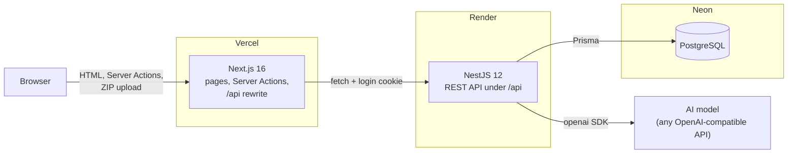
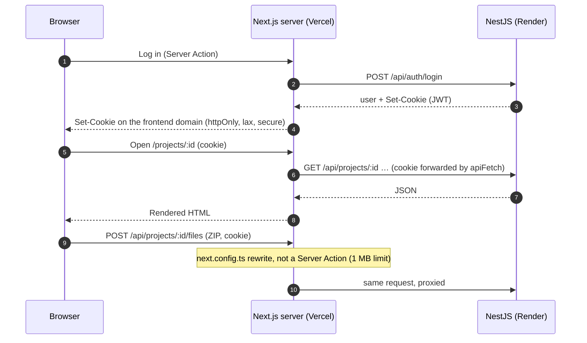
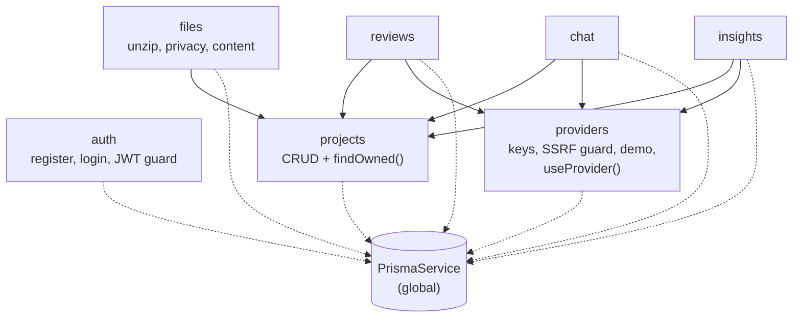
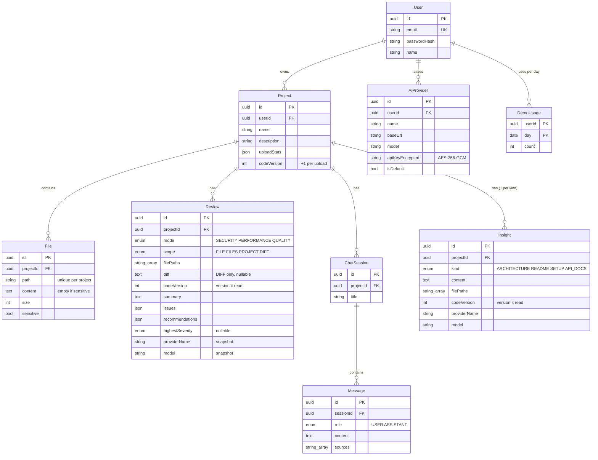
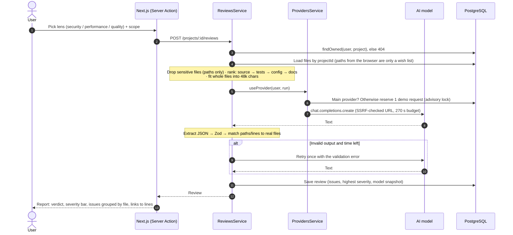
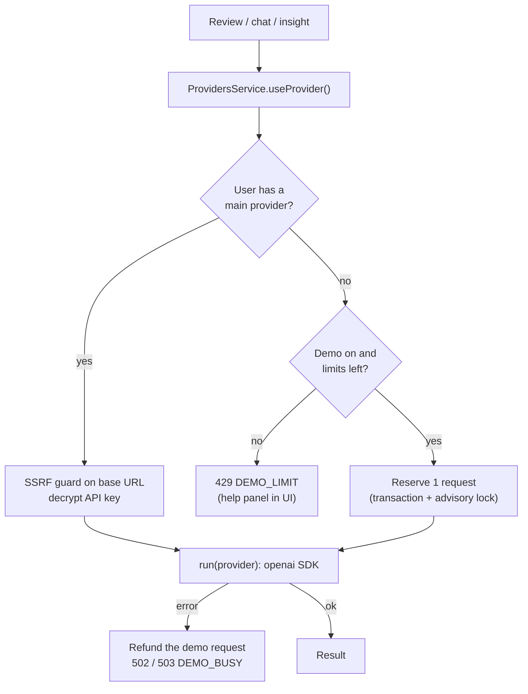
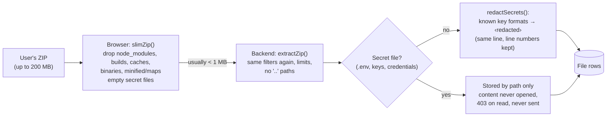

# Architecture

Redline is a code review assistant: you upload a project as a ZIP, and an AI model of your choice reviews it for security, performance or code quality, answers questions about it, and drafts its documentation.

This document explains how the parts fit together and why they were built this way.

- [1. System overview](#1-system-overview)
- [2. Backend for frontend (BFF)](#2-backend-for-frontend-bff)
- [3. Backend modules](#3-backend-modules)
- [4. Frontend structure](#4-frontend-structure)
- [5. Database](#5-database)
- [6. Review flow](#6-review-flow)
- [7. AI providers and the demo model](#7-ai-providers-and-the-demo-model)
- [8. Privacy and security](#8-privacy-and-security)
- [9. Limits](#9-limits)
- [10. Trade-offs and next steps](#10-trade-offs-and-next-steps)

## 1. System overview



| Part | Tech | Job |
|---|---|---|
| Frontend | Next.js 16 (App Router), React 19, Tailwind CSS 4 | UI, server rendering, form handling, calls the API |
| Backend | NestJS 12, Zod, Prisma 7 | Auth, data, file handling, every AI call |
| Database | PostgreSQL 17 (Docker locally, Neon in production) | Users, projects, files, reviews, chats, docs, providers |
| AI | Official `openai` SDK with a configurable base URL | OpenAI, Gemini, Groq, OpenRouter, Ollama, LM Studio… |

## 2. Backend for frontend (BFF)

The browser only ever talks to the Next.js app. The Next.js **server** talks to NestJS.



Why:
- **No CORS and no third-party cookies.** The login cookie belongs to the frontend's own domain, so it works even though Vercel and Render are different domains.
- **Real users for rate limits.** Every call reaches NestJS from the Next.js server, so the Next.js server sends the user's IP in `X-Client-IP`, signed with a shared `BFF_SECRET`. NestJS trusts that header only when the secret matches.
- **The token never reaches browser JavaScript.** It lives in an `httpOnly` cookie. `apiFetch()` (server-only) forwards it, and a `401` sends the user to `/login?expired=1`.
- **One place for data access.** Pages and actions import only `src/lib/api/*`, one module per backend area.
- `proxy.ts` (the Next.js 16 name for middleware) only checks that a cookie exists, to redirect quickly. The backend's global `AuthGuard` does the real check on every request.

The one exception is the upload (a ZIP, loose files or a folder, always re-zipped in the browser first). Server Actions accept at most 1 MB, so the browser sends the ZIP to `/api/...` and `next.config.ts` rewrites it to NestJS. It's the same origin, so the cookie goes along.

## 3. Backend modules



| Module | Main routes (under `/api`) | Notes |
|---|---|---|
| `auth` | `POST /auth/register`, `/login`, `/logout`, `GET /auth/me` | scrypt hashes, JWT (7 days) in an httpOnly cookie. `AuthGuard` is global; open routes use `@Public()`. `@CurrentUserId()` gives the user id |
| `projects` | `GET/POST /projects`, `GET/DELETE /projects/:id` | `findOwned()` is **the** ownership check that every `/projects/:id/...` route uses. Another user's project answers 404 |
| `files` | `POST/GET /projects/:id/files`, `GET /projects/:id/files/content?path=` | Unzips in memory (fflate), filters, redacts secrets. A new upload replaces all files in one transaction |
| `providers` | `/providers` (CRUD, set main, test), `/providers/options`, `/providers/demo` | AES-256-GCM API keys, SSRF guard, demo model. `useProvider()` wraps every AI call |
| `reviews` | `POST /projects/:id/reviews`, `GET /projects/:id/reviews/plan`, `GET /reviews` (paged: `page`, `pageSize`), `GET /reviews/:id` | Prompt building, context budget, output validation, history search in the database, diff reviews (jsdiff) |
| `chat` | `GET /projects/:id/chats` (titles), `GET /projects/:id/chats/:sessionId` (messages), `POST /projects/:id/chats/messages` | Keyword retrieval, top 3 files as sources, last 6 messages as history |
| `insights` | `GET/POST /projects/:id/insights` | Architecture overview, README, setup guide, API docs. One saved document per kind |
| `health` | `GET /health` | Health check for the host |

Shared setup:
- **Validation:** Zod schemas via `@Body({ schema })` and the global `StandardSchemaValidationPipe`.
- **Rate limits:** `UserThrottlerGuard` runs right after `AuthGuard` and counts per signed-in user, or per IP when signed out (`clientIp()`). Auth and AI routes have stricter limits.
- **Configuration:** `requireEnv()` fails fast on missing config. `configureApp()` is shared by `main.ts` and the e2e tests, so the tests run the same app as production.

## 4. Frontend structure

```
frontend/src/
  app/
    (auth)/            login, register + their Server Actions
    (app)/             signed-in app: top bar, icon rail, @context slot
      projects/[id]/   workspace (tree · code/document · Review/Chat/Insights panel)
      projects/[id]/reviews/[reviewId]/   review report
      reviews/         history, grouped by project
      settings/providers/   model cards
  components/          ui/ primitives + one folder per area
  content/             page text (components receive it as props)
  lib/api/             server-only data access (apiFetch)
  lib/                 URL state, grouping, formatting, ZIP slimming
  proxy.ts             optimistic cookie check
```

- **Server Components by default.** Pages are async and read data through `lib/api`. Client components exist only where state or events are needed (forms, dialogs, menus, the upload).
- **Mutations are Server Actions.** They check input, confirm ownership through the backend, then call `revalidatePath`. Forms use `useActionState` and native HTML validation.
- **The URL is the state.** The selected file, line, panel tab, chat session and open document (`?file=…&line=…&tab=insights&doc=setup`) all live in the query string, built by `workspaceHref()`. Reload, back/forward and shared links all work.
- **Code highlighting** runs on the server (Shiki). The HTML is escaped by Shiki, so no user code runs.
- **Generated documents** are rendered with react-markdown + remark-gfm (tables, task lists). It builds React elements, ignores raw HTML and removes `javascript:` links.

## 5. Database



Design notes:
- **UUID v7 ids.** They sort by time, and the API rejects any other id format early (`ParseUUIDPipe`).
- **Cascades.** Deleting a user or project removes everything under it (`onDelete: Cascade`).
- **Snapshots.** Reviews and documents store the provider name and model, so history stays correct after a provider is edited or deleted.
- **Code versions.** `Project.codeVersion` goes up by one on every upload (in the same transaction). Reviews and documents save the version they read. The code viewer shows issue dots only from the newest full review of the current version (never from diff reviews), an older report says the code was replaced, and older documents are marked outdated.
- **`highestSeverity` is stored**, not computed on read, so history can filter and show badges without reading the issues JSON.
- **`issues` and `recommendations` are JSON.** They are always written after Zod validation, so the shape is known.
- **`File.size`** lets the file tree load without file contents. Content is loaded one file at a time.
- **Indexes** on `(userId, createdAt)`, `(projectId, createdAt)` and `(sessionId, createdAt)` match the list queries.

## 6. Review flow



Key points:
- **The model's output is untrusted.** `parseReviewOutput()` pulls the JSON out of the text, validates it with Zod, and matches every file path and line to the files that were sent. An unknown path or line is removed from the issue (the issue itself stays), so "jump to line" links never break.
- **Works with any OpenAI-compatible server.** No `response_format` and no `temperature`, because some servers and models reject them. The prompt asks for JSON, and one retry sends back the exact validation error.
- **Honest about what was read.** If files don't fit the budget, the summary says how many were left out. Before a whole-project review, `GET /reviews/plan` uses the same selection code to show "N of M files fit".
- **Diff Review (bonus).** Scope `DIFF` compares two files. `diffFiles()` (jsdiff) keeps only changed lines plus 3 lines of context, numbered with the *after* file's lines (removed lines have no number). Typed names ("auth.ts") are resolved to one stored path by `resolveTypedPath()` (exact path or a unique ending, else a clear 400). The model is told to review only what the change adds or causes, and its lines are checked against the after file. The unified diff is saved on the review (`Review.diff`), so the report can show it even after the code is replaced.
- **Errors are specific.** A model or network failure returns 502, a used-up demo 429 (`DEMO_LIMIT`), a busy demo 503 (`DEMO_BUSY`). The UI shows a help panel for the demo cases instead of a red error.

Chat and insights follow the same path (`findOwned` → readable files → `useProvider` → save on success):
- **Chat** sends up to 3 files (`pickSources()`): the file open in the workspace first ("explain this file"), then keyword matches (a path match counts more than a content match); when no word matches, the files of the previous answer (follow-ups). Plus the list of all paths and the last 6 messages. The model is called first; the question and answer are saved together in one transaction, so a failed call leaves nothing half saved.
- **Insights** rank files per document kind (for example, routes first for API docs) within 40k characters. The model sees every path but only some files, so it is told to write "not in the files I read" instead of guessing, and the document shows which files it read. One document per kind is kept (upsert).

## 7. AI providers and the demo model



- **Bring your own model.** A user can save several providers (name, base URL, model, optional key). One is the main provider, and one click on a saved card makes it main. "Test connection" calls `GET /models` and suggests the model names it finds.
- **API keys** are encrypted with AES-256-GCM (`ENCRYPTION_KEY`, a new random IV each time, tamper detection). They are never sent back to the browser (`hasApiKey` only). A stored key is only ever sent to the base URL it was saved with; changing the URL requires entering the key again.
- **Demo model.** It's configured only through server env (`DEMO_*`), with 10 requests per user per day and 200 per day for the whole site (UTC). Counting uses a Postgres advisory lock inside a transaction, so parallel requests can't go past the limit. Failed calls are refunded.

## 8. Privacy and security



- **Secret files** (`.env*` except examples, `.npmrc`, SSH and TLS keys, cloud credentials, `*.tfstate`, …) are uploaded **empty** by the browser. The backend checks again (someone could call the API directly), stores only the path, refuses to open it (403), and never sends it to a model. Reviews still receive the paths, so the model can warn "you committed an env file".
- **Secrets inside code** (OpenAI/Stripe/Google/GitHub/AWS/Slack keys, JWTs, private keys, `password = "…"`) are replaced with `‹redacted›` on the same line before saving. This is pattern based, so it catches common formats, not every possible secret.
- **Ownership.** Every query is scoped to the user. Other users' ids answer 404, which reveals nothing. Server Actions confirm ownership through the backend before acting.
- **SSRF guard.** Provider URLs are resolved through DNS and blocked if they point to private, loopback or link-local ranges (`net.BlockList`). Redirects are refused, and there's a 10 s timeout for tests. `ALLOW_LOCAL_PROVIDERS=true` exists for local development only.
- **Uploads.** The ZIP is unzipped in memory with size, count and zip-bomb limits; the file count is checked before anything is inflated. Paths containing `..` are rejected (zip slip). 10 uploads per minute per user.
- **Auth.** scrypt password hashes, JWT in an `httpOnly` + `SameSite=Lax` cookie (+ `Secure` in production), and open-redirect protection on `?next=`. Login is protected in layers:
  - 10 login/register tries per minute per IP.
  - 5 failed logins for one account from one IP → wait 15 minutes.
  - 20 failed logins for one account from all IPs in an hour → wait. The lock is short, so an attacker can't lock the owner out for long.
  - An unknown email is checked against a dummy hash, so the response time doesn't reveal which emails have accounts. Unknown emails are counted too.
- **Untrusted model output.** Reviews are validated with Zod, and paths and lines are checked against real files. Documents are rendered without raw HTML.
- **Security headers.** The web app sends a Content-Security-Policy (only its own origin; `frame-ancestors 'none'`), `X-Content-Type-Options: nosniff`, `X-Frame-Options: DENY` and a referrer policy (`next.config.ts`). Neither app sends `X-Powered-By`. The CSP allows inline scripts because Next.js inlines its page data; per-request nonces would be the stricter next step.
- **Behind a proxy.** `trust proxy` is set to one hop, and `X-Client-IP` is only trusted with the shared secret, so a faked header can't get around the limits.

## 9. Limits

| What | Limit |
|---|---|
| ZIP picked in the browser | 200 MB (slimmed before upload) |
| ZIP received by the backend | 10 MB · 2,000 files · 512 KB per file · 50 MB unpacked |
| Review context | 48,000 characters of whole files (counted as sent: header + line numbers) with an own provider (its context size is unknown); 160,000 with the large-context demo model (`DEMO_MAX_CHARS`) |
| Chat context | top 3 files (8,000 characters each), 300 paths, last 6 messages |
| Insight context | 40,000 characters, 500 paths |
| AI call time | 270 s, including the retry (below the 300 s frontend limit) |
| Rate limits (per minute, per user; per IP when signed out) | 100 in general · 10 login/register · 10 uploads · 10 reviews · 20 chat messages · 10 insights · 10 connection tests |
| Failed logins per account | 5 per IP in 15 min · 20 from all IPs in 1 hour |
| Demo model | 10 requests per user per day · 200 per site per day |

## 10. Trade-offs and next steps

| Choice now | Why | When to change |
|---|---|---|
| Synchronous AI requests (no queue) | Simple; fits the 270 s budget | Background jobs + polling if reviews get slower |
| Keyword retrieval for chat | Explainable, no extra infrastructure | Embeddings (pgvector) if answers miss relevant files |
| History search = `ILIKE` on a saved `searchText` column, 20 per page | Simple, in the database, no extension | A `pg_trgm` index or full-text search for very large histories |
| Whole files within a character budget | Works with small local models | Chunking and merging for very large projects |
| No streaming | Answers take a few seconds | Server-sent events if answers feel slow |
| Rate-limit and login counters in memory | One API instance on Render | Redis or a table when running several instances |
